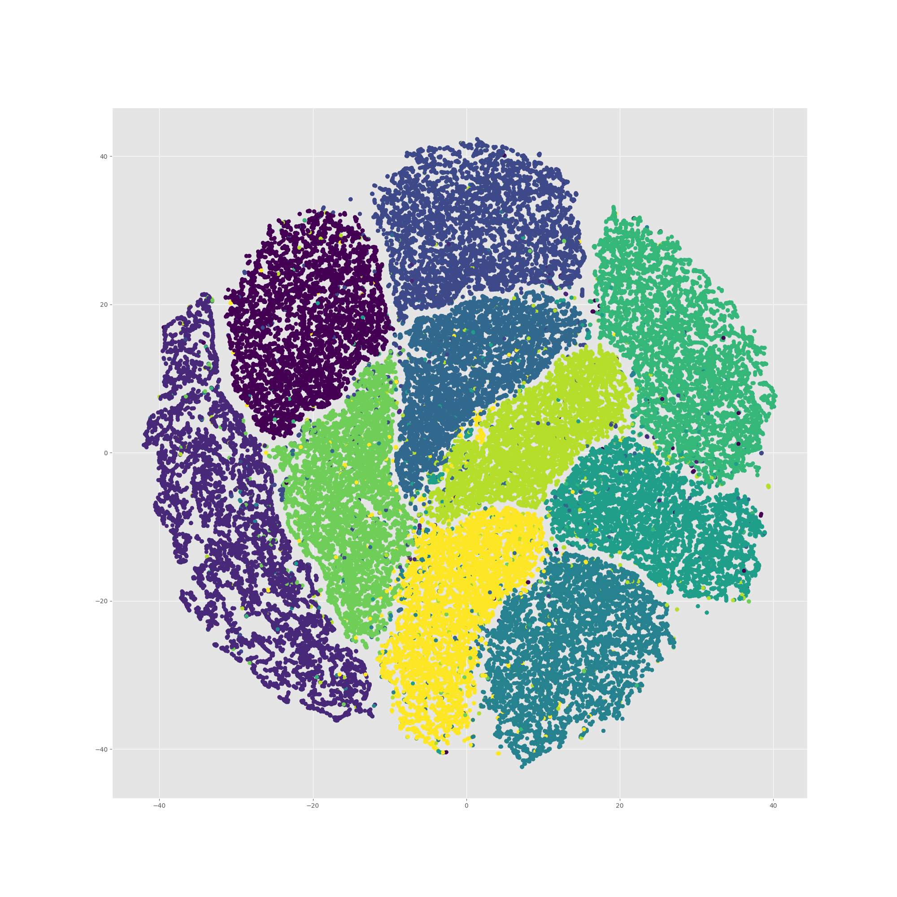
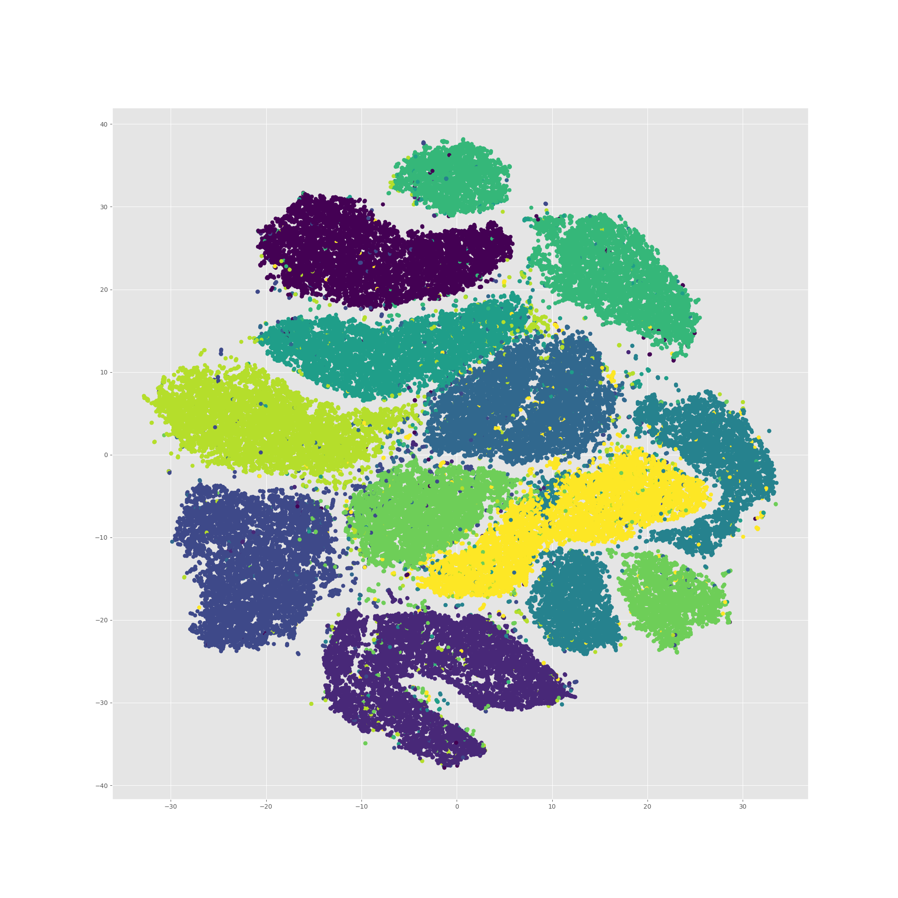
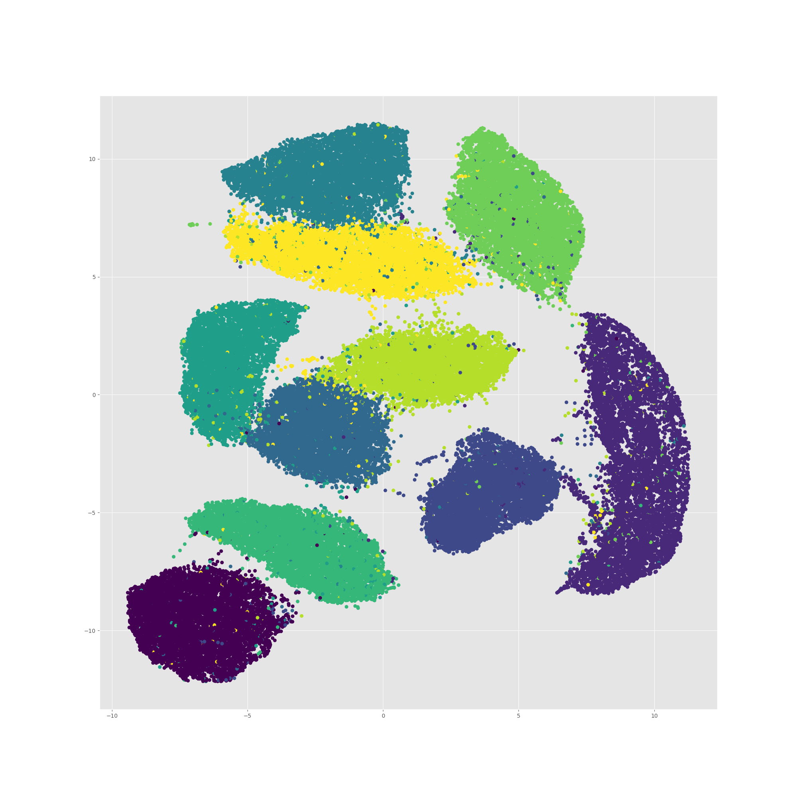

# Performance Comparision of A Number of Dimensionality Reduction Libraries

There are a number of alternatives to choose from when you need to 
[reduce dimensions of a large data set](https://www.youtube.com/watch?v=YPJQydzTLwQ) (for
visualization, etc.). This repository was put together to allow for easy head to head evaluation of a number of
[tsne](https://en.wikipedia.org/wiki/T-distributed_stochastic_neighbor_embedding) and 
[umap](https://arxiv.org/abs/1802.03426) implementations, two of the top contendenders for dimensionality reductions that perserves localized
grouping. This is primarily meant for performance evaluation, but we include visualization of results for a few of the
candidate libraries for a qualitative comparision as well.

The libraries included in the comparision are:
* [lvdmaaten](https://github.com/lvdmaaten/bhtsne.git) - Initial implementation
* [10XDev](https://github.com/10XDev/tsne.git) - A python wrapper around lvdmaaten's implementation (and some improvements)
* [danielfrg](https://github.com/danielfrg/tsn.git) - The "standard" python version available from pypi and conda
* [resero-labs](https://github.com/rappdw/tsne.git) - A fork of 10XDev that uses openmp to take advantage of multiple cores (available on pypi as tsne-mp)
* [tsne-cuda](https://github.com/CannyLab/tsne-cuda) - A CUDA implementation still in early development but very promising
* [umap](https://github.com/lmcinnes/umap) - A python/numba implementation of UMAP

To run the test:

* pre-requisites
  1) python 3.6 or greater (used to run utilities to build and run docker files
  2) dockerutils - `pip install dockerutils` (allows seemless interaction with both local and remote docker images and containers) 
  3) setup EC2 instances (M5.12xlarge and P3.2xlarge for CPU and GPU testing)

* Build & run
  1) build tsne-cuda python wheel and libfaiss.so, place them in ./docker/gpu (tsne-cuda is under active development 
  and getting the correct version of the wheel and libfaiss.so is a bit tricky, see dwr/explorations branch on 
  [this fork](https://github.com/rappdw/tsne-cuda) of tsne-cuda)
  2) `build-image all` (builds two docker images, tsne-perf-test-cpu and tsne-perf-test-gpu)
  3) For CPU test, `run-image cpu -c full.mnist` (or iris, or 2500.mnist or cifar)
  4) for GPU test, `run-image -g gpu -c full.mnist`

## Other Implementations to Consider 
### scikit-learn
Because of implementation differences we don't include scikit-learn in the performance test. scikit-learn performs 
significantly slower than any of these implementations (approximately twice as long as the lvdmaaten implementation 
with informal testing).

### Multicore-TSNE
We initially looked at including this in the evaluation, but the qualitative results we poor in our judgement.

## Results
Using the docker images built we ran a number of tests on m5 and p3 EC2 instances recording the elapsed wall clock time,
the amount of memory usage and the cumulative CPU utilization observed during the execution of the test. We are using
standard datasets (iris, mnist, cifar) readily available, but converted to the lvdmaaten 
[`.dat` file format](https://lvdmaaten.github.io/tsne/User_guide.pdf)) (there are utilities available in this repo
to read/write/convert that file format).

### On an EC2 m5.12xlarge instance
#### 2500 Instance MNIST Data 

| Repo        | Wall Time (s) | Max Memory (kb) | Cumulative CPU % |
| ----------- | ------------- | --------------- | ---------------- |
| lvdmaaten   | 16.04         | 14516           | 99               |
| umap        | 11.80         | 285512          | 169%             |
| danielfrg   | 7.80          | 34096           | 99               |
| 10XDev      | 7.69          | 14612           | 99               |
| resero-labs | 3.15          | 13020           | 3948             |

#### 70,000 Instance MNIST Data 

| Repo        | Wall Time (s) | Max Memory (kb) | Cumulative CPU % |
| ----------- | ------------- | --------------- | ---------------- |
| lvdmaaten   | 6064.91       | 1426784         | 99               |
| 10XDev      | 3753.59       | 1426692         | 99               |
| danielfrg   | 2100.58       | 1426288         | 99               |
| resero-labs | 329.98        | 1436172         | 3588             |
| umap        | 102.73        | 2127828         | 243%             |

### On an EC2 p3.2xlarge instance

#### 70,000 Instance MNIST Data
| Repo        | Wall Time (s) | Max Memory (kb) | Cumulative CPU % |
| ----------- | ------------- | --------------- | ---------------- |
| resero-labs | 798.18        | 1504632         | 714              |
| tsne-cuda   | 22.59         | 2456588         | 123              |

### Qualitative Results

#### tsne-mp

#### tsne-cuda

#### umap

## Conclusions

If you have a gpu and you are willing to work with early days code, the tsne-cuda implementation beats all others
handsdown.

If you don't have a gpu, then use either umap or tsne-mp.
